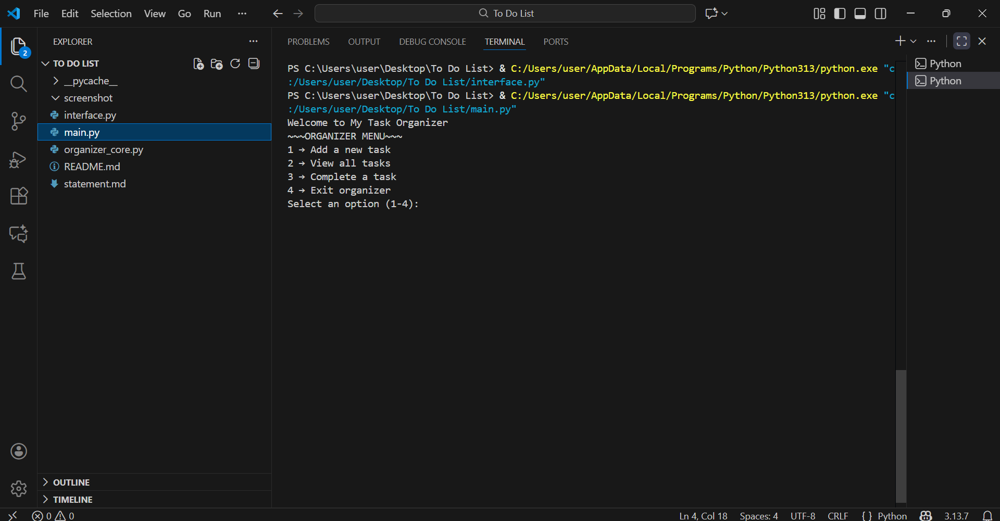
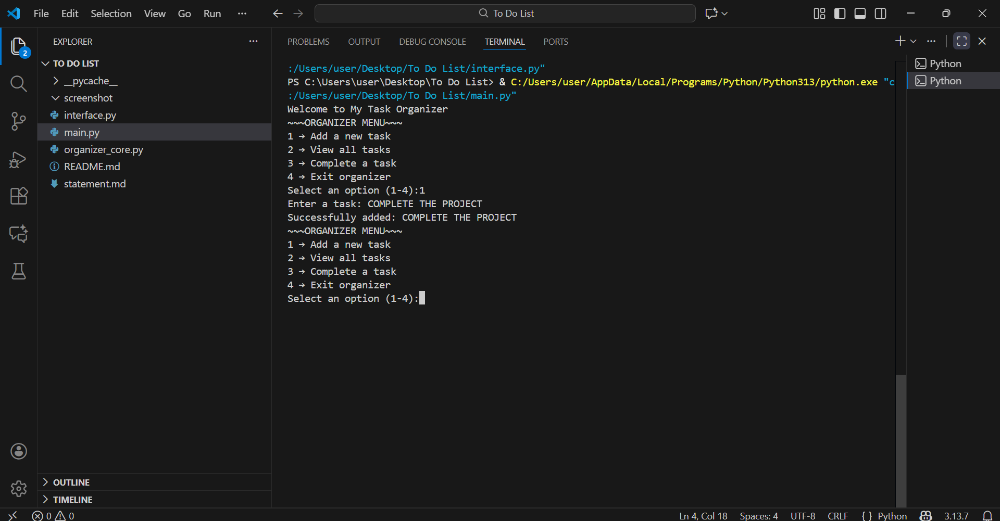
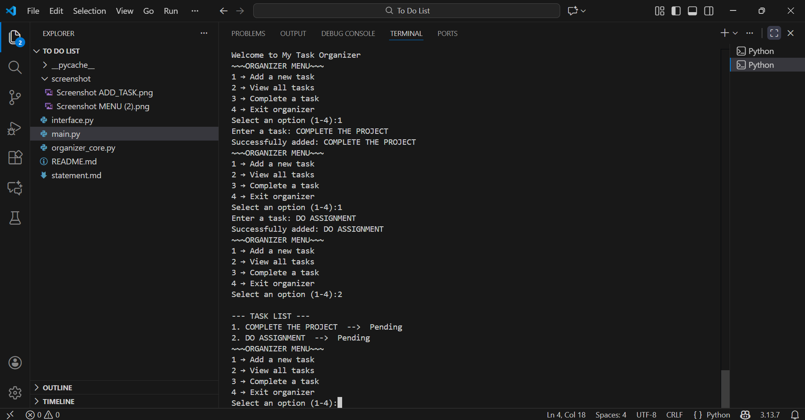
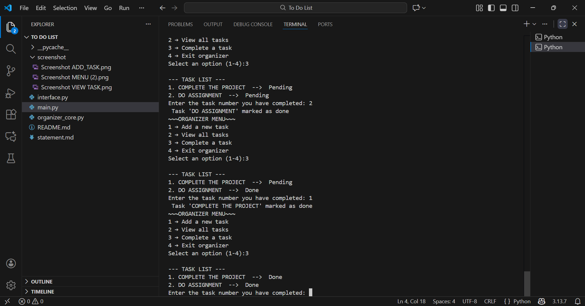
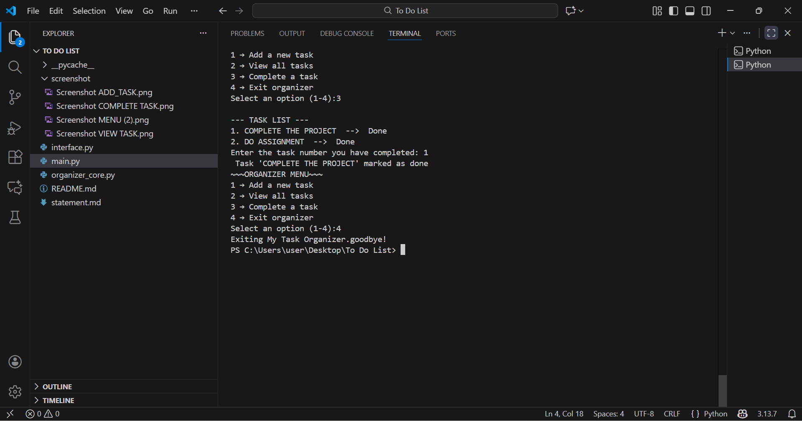

# Task Organizer – Command-Line Productivity Tool

## Student Information

- Name: NEHAL GARG
- Reg No.: 25BCE10492  
- Course: INTRODUCTION TO PROBLEM SOLVING AND PROGRAMMING   
- Domain: Productivity & Automation  

## Overview
The Task Organizer is a simple command-line application designed to help users manage daily tasks efficiently.  
It allows users to add tasks, view all saved tasks, and mark tasks as completed.  
The project follows modular programming principles and is split into multiple Python files such as `main.py`, `interface.py`, and `organizer_core.py`.

This project is built as part of the flipped-course evaluation under the Productivity & Automation domain.

---

## Features

### Functional Modules
The project satisfies the guideline requirement of having at least three functional modules:
1. **Task Input Module** – Add new tasks to the list  
2. **Task Display Module** – View all pending and completed tasks  
3. **Task Completion Module** – Mark a selected task as completed  
4. **Program Control Module** – Menu navigation and exit functionality  

### Input/Output Structure
- **Input:** Task descriptions, menu selections, task number for completion  
- **Output:** Updated task list, status messages, completion confirmations  

### Workflow
1. User launches the program using `main.py`  
2. A menu appears with available operations  
3. Based on input, appropriate functions from `organizer_core.py` are executed  
4. User may continue or exit  

---

## Technologies & Tools Used
- **Language:** Python  
- **Libraries:** Built-in only  
- **Concepts Applied:**  
  - Modular programming  
  - Lists and dictionaries  
  - User input handling  
  - Control flow (loops and conditionals)  
  - Separation of concerns  

---

## System Architecture

The project follows a simple but clean modular architecture:

```
main.py
 └── interface.py
        └── organizer_core.py
```

### Module Responsibilities
- **main.py:** Entry point of the program  
- **interface.py:** Displays menu and directs program flow  
- **organizer_core.py:** Core logic for adding, viewing, and completing tasks  

---

## Installation & Running Instructions

### Requirements
- Python 3.x  
- No external libraries required  

### Steps to Run
1. Download or clone the repository  
2. Ensure all `.py` files are in the same directory  
3. Open a terminal in the project folder  
4. Run the command:

```
python main.py
```

5. Use the menu to:  
   - Add a task  
   - View tasks  
   - Mark a task as complete  
   - Exit the organizer  

---

## Testing Instructions
To test the program manually:
1. Run the application  
2. Add multiple sample tasks  
3. View task list to ensure correct listing  
4. Mark specific tasks as completed  
5. Verify that status updates from `Pending` to `Done`  
6. Try invalid inputs (empty tasks, invalid numbers) to test error handling  

---

## Screenshots

#### Menu



#### Add Task



#### View Task



#### Complete Task



#### EXIT



**All screenshots of the program running are placed in the */screenshots* folder.**

---

## Project Status
The project has been completed and tested successfully.

